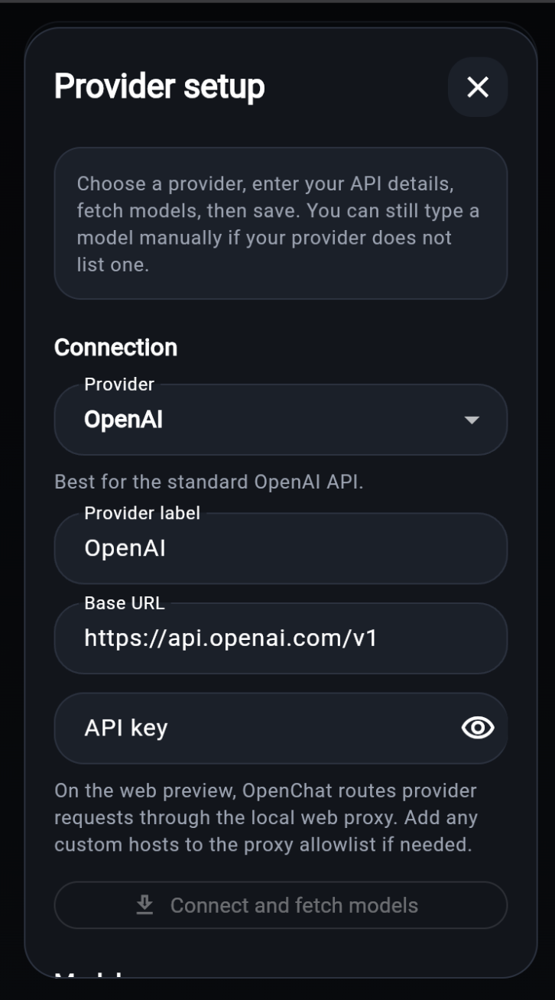
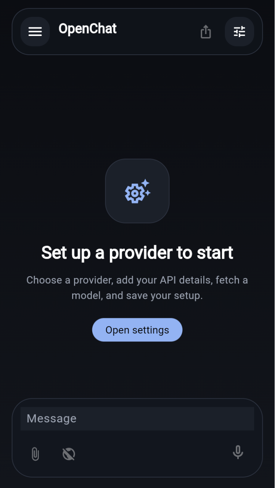
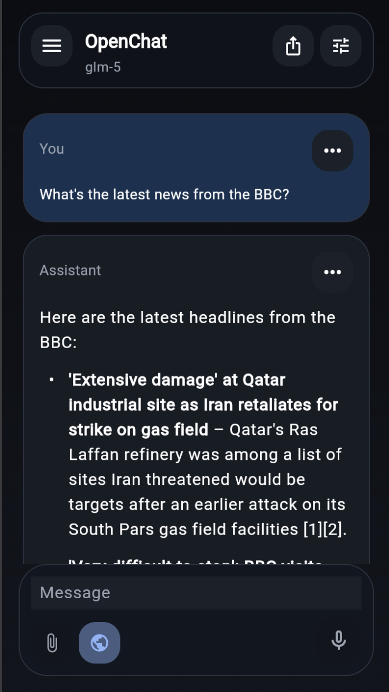

# OpenChat

OpenChat is a Flutter chat client with a ChatGPT-style interface, local conversation history, configurable OpenAI-compatible providers, attachments, voice input on supported browsers, and optional web search/browsing support for questions that need live context.

## Screenshots

<p align="center">
  
  
  
</p>

## Current feature set

- Responsive chat UI for mobile, desktop, and web.
- Provider setup flow with presets for OpenAI, OpenRouter, Groq, Together AI, DeepSeek, Ollama Cloud, and custom OpenAI-compatible endpoints.
- Model fetching plus cached model lists for previously configured providers.
- Streaming assistant responses with markdown and code block rendering.
- Attachment support for camera, photos, and files.
- Local conversation history with rename, duplicate/fork, delete, pin, and search.
- Export conversations as JSON or Markdown and import saved chat data.
- Voice input on supported web browsers.
- Optional DuckDuckGo-backed web search plus multi-step page browsing for live-web prompts.
- Theme selection and desktop/web keyboard shortcuts.

## Local development

### Prerequisites

- Flutter stable
- Dart SDK (bundled with Flutter)

### Install dependencies

```bash
flutter pub get
```

### Run the app

```bash
flutter run
```

### Run the web preview

OpenChat uses a small local proxy during web development so the browser can call provider APIs and fetch public web pages without CORS issues.

Start the proxy:

```bash
dart run tool/web_cors_proxy.dart
```

Then start the app in web-server mode:

```bash
flutter run -d web-server --web-hostname 127.0.0.1 --web-port 8101
```

By default the proxy listens on `http://127.0.0.1:8081/proxy`.

Useful proxy environment variables:

```bash
OPENCHAT_PROXY_ALLOWED_HOSTS=host1,host2 dart run tool/web_cors_proxy.dart
OPENCHAT_PROXY_PORT=8082 dart run tool/web_cors_proxy.dart
```

The default allowlist already includes:

- `api.openai.com`
- `openrouter.ai`
- `api.groq.com`
- `api.together.xyz`
- `api.deepseek.com`
- `ollama.com`
- `api.duckduckgo.com`
- `html.duckduckgo.com`

## Quality checks

Run static analysis:

```bash
flutter analyze
```

Run tests:

```bash
flutter test
```

The repository also includes GitHub Actions that run both commands automatically on pushes and pull requests.

## GitHub Actions and release flow

This repository ships with two workflows:

- `CI` installs dependencies, runs `flutter analyze`, and runs `flutter test`.
- `Release Builds` runs for tags matching `v*` and publishes release artifacts to GitHub Releases.

The tagged release workflow currently produces:

- Android APK: `app-release.apk`
- Android App Bundle: `app-release.aab`
- iOS simulator archive: `OpenChat-ios-simulator.zip`

Trigger a release build with:

```bash
git tag v0.1.0
git push origin v0.1.0
```

## Release notes

- Android artifacts are built in CI and are useful for testing, but production signing is not configured yet.
- The iOS artifact is an unsigned simulator build for review/testing, not an App Store or physical-device build.
- Signed store-ready mobile releases still require platform signing credentials and provisioning setup.
